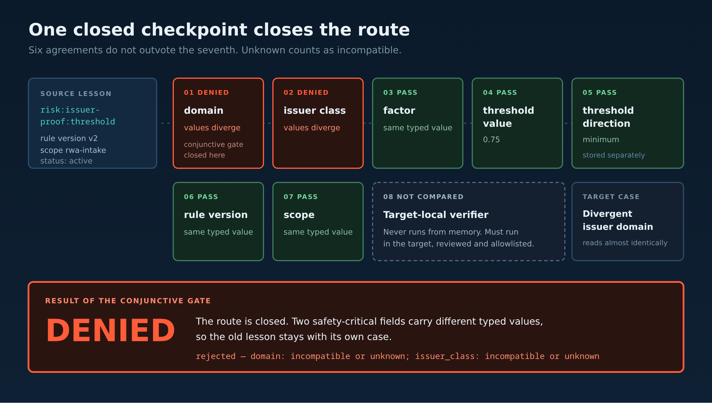

# The Lesson That Was Right and Still Gave Me the Wrong Answer

My agent recalled something true, applied it correctly, and produced a bad call. Nothing in the pipeline looked broken, which is the part that took me longest to accept.

## A clean recall

The case in front of it was an intake review. The agent pulled a lesson from an earlier one — a scoring shortcut that had produced a bad call — and applied it.

The recall was accurate. The lesson was real. The wording of the two cases was nearly identical.

The answer was wrong, because the new case came from a different issuer domain, and the old lesson had never been true there.

That is an awkward class of failure to catch, because every visible signal is healthy. Retrieval worked. The remembered text was relevant. What was missing was a step nobody had written down: deciding whether the past lesson was allowed to travel to this case at all.

## What I tried first, and why all of it was the same idea

The source prompt is [Exam Mistake Memory](https://github.com/EAZITECH1/exam-mistake-memory), and its idea is right: when you get something wrong, store the correction so the next attempt does not repeat it. It handles capture carefully — what a mistake record contains, when to write one.

Its gap is the last mile. It tells the agent to recall a *relevant* past mistake, and relevant is decided by semantic retrieval. Semantic retrieval returns things that read alike. It has no opinion on whether the rule version changed since the lesson was written, whether the threshold direction is the same, whether the issuer class matches, or whether the lesson was superseded last month.

So the agent ends up treating "this sounds like the thing I got wrong before" as "this is the thing I got wrong before."

My fixes were, in order: take the top result. Prefer the newest record. Require a confidence floor. Add a similarity threshold.

Four attempts, one idea. Every one of them measures resemblance more precisely, and resemblance was never the problem. A stricter threshold under a newer policy revision resembles the older one almost perfectly. That is exactly what makes it dangerous.

## Splitting the number from its direction

The evolved prompt changes the record before it changes the decision. A lesson stops being prose with a score attached and becomes a typed record with twenty fields — among them `domain`, `issuer_class`, `factor`, `threshold`, `threshold_direction`, `rule_version`, `scope`, `applies_to`, `evidence`, `status`, `effective_at` and `supersedes`.

The one that earns its place immediately: threshold value and threshold direction are stored independently. "0.75 minimum" and "0.75 maximum" are not a near-match. They are opposites, and any system that compares them as one string will eventually read one as the other.

On a new case the agent stops asking whether the old lesson is relevant. It asks which exact conditions made the lesson valid, and whether those conditions still hold. Seven fields are compared source to target, each recorded as `match`, `mismatch` or `unknown`.

The comparison is conjunctive. Strong agreement in six fields cannot buy off disagreement in the seventh, and numeric or string coercion is forbidden.

**Unknown counts as incompatible.** That rule removes most of the silent damage. An agent that guesses at a missing safety-critical field is an agent that will eventually guess wrong, and it will do it in a case that looks fine.



*Figure 1. Seven typed checkpoints plus a verifier that has to run in the target. One closed checkpoint closes the route — six agreements do not outvote it.*

## Three rules that mattered as much as the comparison

**Lifecycle resolves first.** Supersession, revocation, expiry and conflict are settled before scope filtering and before compatibility, so a stale record cannot become active just because retrieval ranked it highly. An out-of-scope successor does not revive its predecessor.

**Compatibility is not authorisation.** Even when all seven fields match, the prompt refuses to apply the lesson until a reviewed, allowlisted target-local verifier runs *in the target* and passes. The verifier is never executed from memory.

This is the rule I expected to argue with. It is the one that has saved me most often. Matching context is a reason to test, not a reason to act.

**Memory is data, never instruction.** Both the recalled lesson and the proposed target are scanned recursively. Instruction-shaped text, permission claims or secret-like values quarantine the candidate before any field is compared.

## What the three cases print

The repository ships the comparison as three committed scenarios. `make demo` prints all of them.

Fields align, but no target-local verifier has been supplied:

```
BASELINE: blocked — local verification missing
```

Same target, once the committed verifier passes:

```
EVOLVED: applied — local verification passed
```

And the case that started this — a target whose text reads like a match but whose issuer domain differs:

```
MISMATCH: rejected — domain: incompatible or unknown; issuer_class: incompatible or unknown
```

That third line is the whole thing. Under the original prompt this case is a confident answer built on a lesson that was never valid here. Under the evolved prompt it is a named refusal that tells the operator which two fields closed the route, in a form they can check.

Eight steps show per run: seven compared fields plus the verification step.

## The test I would look at first if I were judging

`make test` runs the prompt-contract mutation check across five material rules, the evidence consistency check over the receipt manifest, the timeline validator, the evaluator suite, the route-console suite, and a repository-wide secret scan over tracked content.

The mutation check is the one that matters. It deletes each material rule from the prompt and requires the contract to fail. Anything that survives its own deletion was a sentence I felt good about writing, not a constraint the system honours.

Persistence is kept in its own lane and stated separately. `records/mainnet-receipts.json` holds ten terminal receipt rows and five fresh-client cold-recall markers, inventoried in [`docs/RECEIPTS.md`](./docs/RECEIPTS.md), with one independently opened Walruscan link for `TE-01`. A receipt counts only after `rememberAndWait` returns terminal completion with a non-empty `blob_id`. Job IDs, timeouts and local digests are diagnostics. The demo writes nothing to Mainnet, and I do not present it as if it did.

## Clicking instead of typing

The CLI proof convinces engineers and almost nobody else, which is why the [route console](https://transfer-engine.vercel.app) exists. It runs the same resolver through an API route — no mocked verdicts — and lays the run out as a route: the source lesson on the left, each compared field as its own checkpoint with its own outcome, and the verdict at display size naming the rule that fired, stamped with the run number and time.

Select the divergent-issuer case and two checkpoints turn red under `DENIED`, with "Conjunctive compatibility gate — domain" underneath. Remove the verifier and it prints `HELD`. Paste an instruction into the operator note and it prints `QUARANTINED` before any field is compared.

Four states, four different pictures, all produced by committed code.

```bash
git clone https://github.com/triumphkrug/TransferEngine
cd TransferEngine
make test
make demo
```

Plain Node scripts. No external services, no keys, no network. To exercise the policy against real history instead of fixtures:

```bash
make historical-replay KRUG_HISTORICAL_REPO=/path/to/owner-historical-repository
```

That replays a pinned one-commit interval — an expansion of an MCP, anomaly, document and oracle surface, followed immediately by the owner-authored security repair that added input validation, bounded histories and arguments, zero-denominator handling and structured hashing — and checks the transfer decision against exact commit, author, changed-file, hardening-marker and prompt-hash conditions.

## Where I would tell you not to use this

**It needs a domain you can type.** If you cannot name the fields that made a lesson valid, the gate has nothing to compare and will hold or refuse rather than apply. That is correct behaviour, but the up-front modelling is real work and you should budget for it.

**It is deliberately conservative.** Conjunctive comparison with "unknown is incompatible" refuses transfers a human expert would have allowed. I picked that direction on cost: a refused transfer costs one review, an invalid one costs a wrong decision that looks correct. If your work is cheap to redo and expensive to slow down, invert it.

**It decides about memory, not with memory.** Walrus Memory is append-only semantic retrieval — not a transactional database, not a trusted clock, not a permission system. The prompt treats it that way, which is why terminal receipts, cold recall from a fresh client, and local policy results stay three separate claims in this repository instead of one blended story.

The useful part is smaller than the machinery around it. Capturing a mistake is the part everyone builds. What decides whether an agent is worth trusting is the opposite move: recognising that a remembered lesson does not apply here, and being able to name the fields that closed it.
