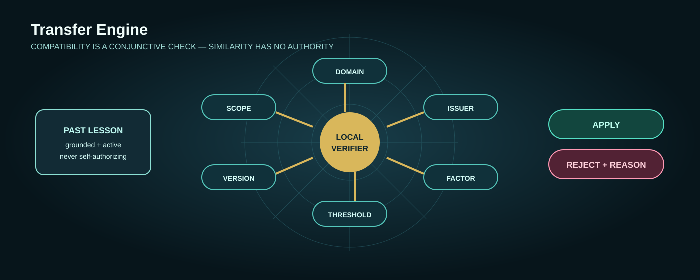

# Transfer Engine

> **A past lesson transfers only when its domain compatibility can be explained.**

An evolution of [Exam Mistake Memory](https://github.com/EAZITECH1/exam-mistake-memory). That prompt captures mistakes so they are not repeated. Transfer Engine adds a compatibility gate: a lesson from one risk case can guide a new case only if the factor, issuer/domain, threshold, scope, and effective rule version match.




## Interactive verification lab

**Run in browser:** [interactive verification lab](https://transfer-engine-krug.vercel.app)  
**Reproduce locally:** `make test && make demo`

The browser lab renders one transfer route: a recalled lesson enters at the left, each compared field is a checkpoint, and the route only opens when every checkpoint matches and a reviewed target-local verifier passes. The page calls the canonical resolver in [`intelligence/evaluator.mjs`](./intelligence/evaluator.mjs) through [`web/app/api/evaluate/route.js`](./web/app/api/evaluate/route.js) — there are no simulated verdicts.

The operator note in the lab is real input: it is attached to the target record as `analyst_note` and is scanned by the same recursive trust-boundary scan the CLI uses, so instruction-shaped or secret-like text sends the candidate down the quarantine route. It can never set a compared field value, so benign text leaves a committed fixture result unchanged. Each run also prints the verbatim canonical outcome and reasons.

The lab is read-only and deterministic. It does not create a Mainnet write; committed receipt and fresh-client proof remain separate evidence in `records/`.

Run the lab locally:

```bash
cd web && npm install && npm run build && npm start
```

## Problem

Semantic similarity is not compatibility. A prior scoring anomaly may look relevant to a new asset while involving a different issuer type, risk factor, threshold, or policy revision. Blindly transferring it creates a confident wrong answer; discarding all history loses useful learning.

## Reproduce

```bash
make test
make demo
```

The local scenario uses a typed risk model. It accepts a prior lesson for the same factor/domain/rule revision, and rejects a superficially similar lesson when issuer domain differs. It is a deterministic policy demonstration, not a claim about a live asset or on-chain score.

### Owner-scoped historical replay

The replay package in [`replay/historical-owner-replay.json`](./replay/historical-owner-replay.json) applies the evolved policy to a verified owner-scoped historical interval. It selects the direct one-commit interval from `cf124f605084f3c065ee020cd6398b363a63063f` to `1bab9bc92eda998b4f43b82aa00312db21d78bc8`: the prior commit expanded the MCP/anomaly/document/oracle surface; the next owner-authored security repair added input validation, bounded histories and arguments, zero-denominator handling, and structured hashing.

Reproduce against a full clone:

```bash
make historical-replay KRUG_HISTORICAL_REPO=/path/to/owner-historical-repository
```


## Evidence plan

The local evaluator proves only typed compatibility policy. [`records/mainnet-receipts.json`](./records/mainnet-receipts.json) separately records the committed 10 terminal receipt rows and five fresh-client recall markers; it is not a new write from `make demo`. The historical replay becomes evidence only when run against the authorized owner-scoped clone above.

## Structure

```text
TransferEngine/
├── intelligence/     compatibility evaluator and transfer map
├── cases/            versioned typed risk cases
├── records/          stage plan and safe receipts
├── visuals/          rendered pipeline graphic
├── spec/             deterministic regression tests (evaluator + lab layer)
├── web/              Next.js verification lab (canonical resolver via API route)
├── PROMPT.md
├── ARTICLE.md
├── ISSUE.md
└── Makefile
```

## Video

Show a risk lesson entering the compatibility gate twice: one case shares its risk context and is applied after a local scorer check; the other has a domain mismatch and is rejected with a reason. The receipt board may show only the committed terminal receipts and fresh-client recalls; it must not present the local compatibility fixture as storage proof.

## Judge-first recording script

[`JUDGE_RECORDING.md`](./JUDGE_RECORDING.md) is the 85–90 second CLI-first recording plan: observed failure → deterministic guard → reproducible assertion → explicit evidence boundary. It deliberately avoids credentials and cost-bearing writes.

## Owner submission packet

[`SUBMISSION_PACKET.md`](./SUBMISSION_PACKET.md) is the owner-only closeout gate: one-page judge path, source-feedback draft, article/social/video links, dedicated Sessions-wallet proof, and final-form checklist. It distinguishes preparation from actions that only the corresponding owner may take.

## Validation matrix

| Domain | Unsafe shortcut | Final transfer condition | Fixture | Status |
|---|---|---|---|---|
| identity | semantic similarity | exact domain and issuer class | `spec/evaluator.test.mjs` | pass |
| policy | rule drift | exact rule version and scope | `spec/evaluator.test.mjs` | pass |
| threshold | “stricter” treated as equivalent | exact value and direction | `spec/evaluator.test.mjs` | pass |
| provenance | ungrounded lesson transfers | high-confidence evidence | `spec/evaluator.test.mjs` | pass |
| lifecycle | stale lesson transfers | reject non-active lesson | `spec/evaluator.test.mjs` | pass |
| application | compatible fields treated as permission to apply | committed target-local verifier must pass | `spec/evaluator.test.mjs` | pass |
| recall | empty/corrupt recall | diagnostic retry then block | live fixture | pending |

## Judge path

`make demo` is intentionally read-only and has four separate screens: **baseline**
(`blocked: local verification missing`) → **evolved** (`applied` only after the
target-local verifier passes) → **mismatch** (`rejected` with named fields) →
**receipt-board boundary**. The historical compatibility fixture is synthetic; the historical replay is separately reproducible against a verified owner-scoped repository. The final line reports
only the committed receipt-manifest structure; it is not a fresh Mainnet run.

## Current SDK proof

A current official-SDK write → terminal non-empty `blob_id` → destroy → new-client exact recall is recorded in [`records/live-sdk-proof-2026-08-21.json`](./records/live-sdk-proof-2026-08-21.json). It validates the SDK path separately from the ten-checkpoint manifest.
