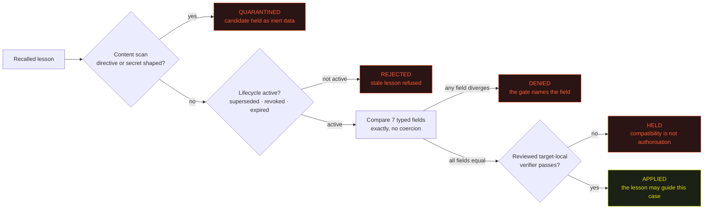

# Transfer Engine — operator field guide

> **A remembered mistake is only useful when the next case is provably the same kind of case.**

[](https://transfer-engine.vercel.app)
[](./PROMPT.md)
[](./docs/RECEIPTS.md)
[](https://github.com/triumphkrug/TransferEngine/actions/workflows/tests.yml)

Evolved from [Exam Mistake Memory](https://github.com/EAZITECH1/exam-mistake-memory).

---

## §1 · When you need this

Reach for Transfer Engine when an agent has memory of past corrections and is about to
**apply one of them to a new case**. That single moment is where recall quietly turns into a
confident error.

| Situation on your desk | Without a compatibility gate | With Transfer Engine |
|---|---|---|
| A past lesson looks like it fits the new case | it is reused on resemblance alone | eight typed checkpoints decide, field by field |
| The lesson was written under an older rule version | it still wins because retrieval ranked it first | lifecycle resolves first; a stale record cannot be revived by rank |
| Every compared field matches | matching is treated as permission to act | a reviewed target-local verifier must still pass in the target |
| Someone pasted text into a record | it can steer the agent | memory is data; directive-shaped content quarantines the candidate |

## §2 · The failure that produced the rule

An agent recalled a past scoring lesson and reused it on a case that read almost identically:
same wording, same shape of question, **different issuer domain**. The recall was correct. The
transfer was not.

Ranking did not fix it. Keeping the top semantic match, preferring the most recent lesson,
requiring a confidence floor — all three measure resemblance, and resemblance is not
compatibility. A stricter threshold under a newer rule version still looks like the old one.

What changed is the unit of memory. A lesson is no longer prose plus a score. It is a **typed
record** — domain, issuer class, factor, threshold value and direction, rule version, scope,
evidence, lifecycle — and each field is compared exactly before the lesson may speak.

> Similarity may propose a candidate. A conjunctive gate plus a reviewed target-local verifier
> decides.

## §3 · The route, from recall to decision



## §4 · Checkpoint reference card

The gate is conjunctive: **all** of it must hold. Print this section and you have the whole
policy.

| # | Checkpoint | Compared how | Fails when |
|---|---|---|---|
| 01 | Domain | exact typed equality | the target belongs to a different domain |
| 02 | Issuer class | exact typed equality | the issuer class diverges |
| 03 | Factor | exact typed equality | the lesson measures something else |
| 04 | Threshold value | exact, no coercion | "stricter" is treated as equivalent |
| 05 | Threshold direction | exact | direction is inverted or implied |
| 06 | Rule version | exact | the lesson predates the current rule |
| 07 | Scope | exact | the lesson belongs to another scope |
| 08 | Target-local verifier | executed in the target | the committed verifier is missing or fails |

| Domain | Unsafe shortcut it removes | Final transfer condition | Fixture |
|---|---|---|---|
| identity | semantic similarity | exact domain and issuer class | `spec/evaluator.test.mjs` |
| policy | rule drift | exact rule version and scope | `spec/evaluator.test.mjs` |
| threshold | "stricter" read as equivalent | exact value and direction | `spec/evaluator.test.mjs` |
| provenance | ungrounded lesson transfers | high-confidence evidence | `spec/evaluator.test.mjs` |
| lifecycle | stale lesson transfers | a non-active lesson is refused | `spec/evaluator.test.mjs` |
| application | compatible fields read as permission | committed target-local verifier passes | `spec/evaluator.test.mjs` |
| recall | empty or corrupt recall | diagnostic retry, then the transfer is held | committed policy fixture |

## §5 · Field exercise — two minutes in the browser

**[transfer-engine.vercel.app](https://transfer-engine.vercel.app)**


| Step | Do this | You should see |
|---|---|---|
| 1 | Select target case **01 Aligned target case**, press *Run the route* | `APPLIED` — every checkpoint matched and the local verifier passed |
| 2 | Select **02 Divergent issuer domain** | `DENIED` — checkpoints 01 and 02 marked denied, the gate names the field |
| 3 | Select **03 No target-local verifier** | the route is held: compatibility alone never opens it |
| 4 | Paste an injection attempt into the operator note | the candidate goes down the quarantine route before any comparison |

Every run is stamped with a run counter and a timestamp, so a new run is never mistaken for
the old one. Beside the verdict, the same case is described with and without the evolved
prompt.

The page has no wallet, no provider key and no storage write. It calls the committed resolver
in [`intelligence/evaluator.mjs`](./intelligence/evaluator.mjs) through
[`web/app/api/evaluate/route.js`](./web/app/api/evaluate/route.js) over committed fixtures, so
no verdict on screen is authored by the interface. Your operator note is real input: it is
attached to the target record as `analyst_note` and scanned by the same trust boundary the CLI
uses — and it can never set a compared field.

## §6 · Quick start — the same decisions in your terminal

```bash
make test
make demo
```

`make test` runs the prompt-contract mutation check, the receipt-consistency check, the
timeline validator, the evaluator and console suites, and a repository secret scan.

`make demo` prints four screens:

| Screen | Output |
|---|---|
| baseline | `blocked — local verification missing` |
| evolved | `applied — local verification passed` |
| mismatch | `rejected — domain: incompatible or unknown; issuer_class: incompatible or unknown` |
| boundary | the committed receipt-manifest summary |

Run the route console locally:

```bash
cd web && npm install && npm run build && npm start
```

Replay the policy against verified owner-scoped history:

```bash
make historical-replay KRUG_HISTORICAL_REPO=/path/to/owner-historical-repository
```

It pins the direct one-commit interval `cf124f605084f3c065ee020cd6398b363a63063f` — which
expanded the MCP, anomaly, document and oracle surface — to its immediate owner-authored
security repair `1bab9bc92eda998b4f43b82aa00312db21d78bc8`, which added input validation,
bounded histories and arguments, zero-denominator handling and structured hashing. The result
is machine-checked against exact commit, author, changed-file, hardening-marker and
prompt-hash conditions.

## §7 · The prompt, block by block

[`PROMPT.md`](./PROMPT.md) is organised as seven blocks, each of which exists because a
specific failure mode exists.

| Block | What it decides |
|---|---|
| Trust boundary | recalled and proposed records are data; directives, permission claims and secret-like values quarantine the candidate |
| Typed lesson record | the 20 fields that make applicability testable, including an independently represented threshold value and direction |
| Admission and lifecycle | what may be written, and how supersession, revocation, expiry and conflict resolve before anything else |
| Compatibility gate | the nine-step adjudication: recall, retry, scan, validate, compare, reject, escalate, verify locally, apply |
| Receipt and recovery protocol | only terminal completion with a non-empty `blob_id` counts as persistence |
| Required decision record | one leading outcome — `applied`, `rejected`, `conflict`, `blocked` — plus a field-by-field table |
| Instruction priority | current policy and observed target evidence outrank recalled lessons; ambiguity resolves fail-closed |

[`spec/prompt-contract.test.mjs`](./spec/prompt-contract.test.mjs) removes each of the five
material prompt rules in turn and requires the contract to fail, so the prompt text and the
executable behaviour cannot drift apart silently.

## §8 · Evidence log

| Record | What it establishes |
|---|---|
| [`docs/RECEIPTS.md`](./docs/RECEIPTS.md) | 10 terminal receipt rows and 5 fresh-client cold-recall markers, with one independently opened [Walruscan Mainnet blob](https://walruscan.com/mainnet/blob/WD_mpJnBS4gz8iXd39Wgmu4DAY3M1o9HDe15jP8nalc) and an explicit note on what it proves |
| [`records/live-sdk-proof-2026-08-21.json`](./records/live-sdk-proof-2026-08-21.json) | a current official-SDK write, terminal non-empty `blob_id`, destroy, and exact recall from a new client |
| [`docs/PROMPT_TO_TEST.md`](./docs/PROMPT_TO_TEST.md) | every material prompt rule mapped to the check that proves it |
| [`docs/REPLAY_RECEIPT.md`](./docs/REPLAY_RECEIPT.md) | the historical replay interval and its pinned outcome |
| [`ARTICLE.md`](./ARTICLE.md) | the write-up of the failure, the evolution and the numbers behind it |

Three claims are kept separate on purpose: the deterministic policy result, the historical
replay, and Mainnet persistence. The route console proves the first one live; it makes no
storage claim.

## §9 · Kit list

```text
TransferEngine/
├── intelligence/     canonical evaluator, shared route runner, CLI demo
├── cases/            versioned typed risk cases
├── records/          receipt manifest, SDK proof, validator
├── replay/           pinned owner-history replay bundle
├── spec/             evaluator, console, prompt-contract, replay tests, secret scan
├── docs/             receipts, prompt-to-test map, replay receipt, console screenshot
├── visuals/          rendered pipeline graphic
├── web/              Next.js route console over the canonical resolver
├── PROMPT.md · ARTICLE.md · DEMO.md · JUDGE_RECORDING.md
└── Makefile
```

## §10 · Your next move

1. **Deny a transfer on purpose** — [open the route console](https://transfer-engine.vercel.app), select *Divergent issuer domain*, read the rule that fired.
2. **Reproduce it offline** — `make test && make demo`.
3. **Adopt the record format** — copy [`PROMPT.md`](./PROMPT.md), then delete one rule and watch `spec/prompt-contract.test.mjs` refuse it.

[`JUDGE_RECORDING.md`](./JUDGE_RECORDING.md) is the 85–90 second recording plan: observed
failure, deterministic guard, reproducible assertion, explicit evidence boundary.

_Last verified against commit `3fde646dc7c623d4a5430d39e9eb27c24774d64b` on 2026-08-23._
