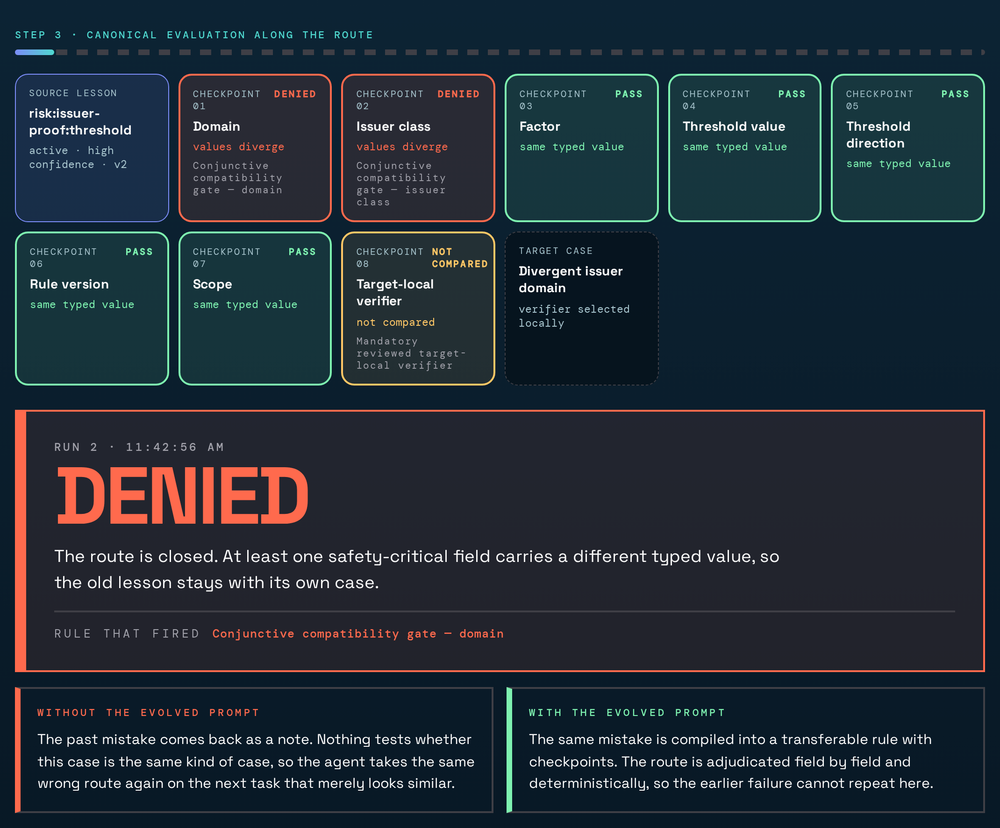

# Transfer Engine

**A remembered mistake is only useful when the next case is provably the same kind of case.**

[](./spec/prompt-contract.test.mjs)
[](./Makefile)
[](./docs/RECEIPTS.md)
[](https://transfer-engine-krug.vercel.app)

Evolved from [Exam Mistake Memory](https://github.com/EAZITECH1/exam-mistake-memory).

---

## The failure that started this

An agent with persistent memory recalled a past scoring lesson and reused it on a case that read almost
identically: same wording, same shape of question, different issuer domain. The recall was correct. The
transfer was not. Memory had turned an old correction into a fresh, confident error, and nothing in the loop
could say why the lesson was allowed to travel.

The first thing I tried was ranking: keep the top semantic match, prefer the most recent lesson, require a
confidence floor. All three fail the same way, because they measure resemblance, and resemblance is not
compatibility. A stricter threshold under a newer rule version still looks like the old one.

What the evolved prompt changed is the unit of memory. A lesson is no longer prose plus a score. It is a
typed record — domain, issuer class, factor, threshold value and direction, rule version, scope, evidence,
lifecycle — and every one of those fields is compared exactly against the new case before the lesson is
allowed to speak. Similarity may only propose a candidate. A conjunctive gate plus a reviewed target-local
verifier decides.

## The pain it removes

| Without a compatibility gate | With Transfer Engine |
| --- | --- |
| A remembered mistake returns as a note, so the same wrong route is taken again on the next similar task. | The mistake is compiled into a transferable rule with checkpoints, so the route is adjudicated deterministically and the earlier failure cannot repeat. |
| A superseded or expired lesson wins because retrieval ranked it first. | Lifecycle is resolved before scope and compatibility; a stale record cannot become active by rank. |
| Matching fields are treated as permission to act. | Compatibility is not authorisation: a reviewed target-local verifier must pass in the target itself. |
| Text pasted into a record can steer the agent. | Memory is data. Instruction-shaped or secret-like content quarantines the candidate before any comparison. |

## The lab, in one screenshot



Every run answers three questions at a glance: which verdict came back (`APPLIED`, `DENIED`, `HELD`,
`QUARANTINED`), which rule produced it, and what that means in plain language — stamped with a run counter
and a timestamp so a new run is never mistaken for the old one. Beside it, the same case is described with
and without the evolved prompt.

**Run it:** [transfer-engine-krug.vercel.app](https://transfer-engine-krug.vercel.app)

The page has no wallet, no provider key and no storage write. It calls the committed resolver in
[`intelligence/evaluator.mjs`](./intelligence/evaluator.mjs) through
[`web/app/api/evaluate/route.js`](./web/app/api/evaluate/route.js) over committed fixtures, so no verdict on
screen is authored by the interface. The operator note is real input: it is attached to the target record as
`analyst_note` and scanned by the same trust boundary the CLI uses, and it can never set a compared field.

## How the prompt is built

[`PROMPT.md`](./PROMPT.md) is organised as seven blocks, each of which exists because a specific failure mode
exists:

| Block | What it decides |
| --- | --- |
| Trust boundary | Recalled and proposed records are data. Directives, permission claims and secret-like values quarantine the candidate. |
| Typed lesson record | The 20 fields that make applicability testable, including an independently represented threshold value and direction. |
| Admission and lifecycle | What may be written, and how supersession, revocation, expiry and conflict resolve before anything else. |
| Compatibility gate | The nine-step adjudication: recall, retry, scan, validate, compare, reject, escalate, verify locally, apply. |
| Receipt and recovery protocol | Only terminal completion with a non-empty `blob_id` counts as persistence. Job IDs and timeouts are diagnostics. |
| Required decision record | One leading outcome — `applied`, `rejected`, `conflict`, `blocked` — plus a field-by-field table. |
| Instruction priority | Current policy and observed target evidence outrank recalled lessons; ambiguity resolves fail-closed. |

The gate is conjunctive across seven compared fields and one verification step, covering these domains:

| Domain | Unsafe shortcut it removes | Final transfer condition | Fixture |
| --- | --- | --- | --- |
| identity | semantic similarity | exact domain and issuer class | `spec/evaluator.test.mjs` |
| policy | rule drift | exact rule version and scope | `spec/evaluator.test.mjs` |
| threshold | "stricter" treated as equivalent | exact value and direction, no coercion | `spec/evaluator.test.mjs` |
| provenance | ungrounded lesson transfers | high-confidence evidence | `spec/evaluator.test.mjs` |
| lifecycle | stale lesson transfers | non-active lesson is refused | `spec/evaluator.test.mjs` |
| application | compatible fields read as permission | committed target-local verifier passes | `spec/evaluator.test.mjs` |
| recall | empty or corrupt recall | diagnostic retry, then the transfer is held | committed policy fixture |

[`spec/prompt-contract.test.mjs`](./spec/prompt-contract.test.mjs) removes each of the five material prompt
rules in turn and requires the contract to fail, so the prompt text and the executable behaviour cannot drift
apart silently.

## Reproduce it in two commands

```bash
make test
make demo
```

`make test` runs the prompt-contract mutation check, the receipt-consistency check, the timeline validator,
the evaluator and lab suites, and a repository secret scan. `make demo` prints four screens: baseline
(`blocked — local verification missing`), evolved (`applied — local verification passed`), mismatch
(`rejected — domain: incompatible or unknown; issuer_class: incompatible or unknown`), and the committed
receipt-manifest boundary.

Run the lab locally:

```bash
cd web && npm install && npm run build && npm start
```

Replay the policy against a verified owner-scoped history:

```bash
make historical-replay KRUG_HISTORICAL_REPO=/path/to/owner-historical-repository
```

It pins the direct one-commit interval from `cf124f605084f3c065ee020cd6398b363a63063f` — which expanded the
MCP, anomaly, document and oracle surface — to its immediate owner-authored security repair at
`1bab9bc92eda998b4f43b82aa00312db21d78bc8`, which added input validation, bounded histories and arguments,
zero-denominator handling and structured hashing. The result is machine-checked against exact commit, author,
changed-file, hardening-marker and prompt-hash conditions.

## Evidence already committed

- [`docs/RECEIPTS.md`](./docs/RECEIPTS.md) — the full inventory of 10 terminal receipt rows and 5
  fresh-client cold-recall markers, with one independently opened
  [Walruscan Mainnet blob](https://walruscan.com/mainnet/blob/WD_mpJnBS4gz8iXd39Wgmu4DAY3M1o9HDe15jP8nalc)
  and an explicit note on what it proves and does not prove.
- [`records/live-sdk-proof-2026-08-21.json`](./records/live-sdk-proof-2026-08-21.json) — a current official-SDK
  write, terminal non-empty `blob_id`, destroy, and exact recall from a new client.
- [`docs/PROMPT_TO_TEST.md`](./docs/PROMPT_TO_TEST.md) — every material prompt rule mapped to the check that
  proves it.
- [`docs/REPLAY_RECEIPT.md`](./docs/REPLAY_RECEIPT.md) — the historical replay interval and its pinned outcome.
- [`ARTICLE.md`](./ARTICLE.md) — the write-up of the failure, the evolution and the numbers behind it.

Three claims are kept separate on purpose: the deterministic policy result, the historical replay, and Mainnet
persistence. The browser lab proves the first one live; it makes no storage claim.

## Where to go next

1. **Open the lab** at [transfer-engine-krug.vercel.app](https://transfer-engine-krug.vercel.app), select
   *Divergent issuer domain*, and read the verdict and the rule that fired.
2. **Reproduce it offline** with `make test && make demo`.
3. **Read the prompt** in [`PROMPT.md`](./PROMPT.md), then delete a rule and watch
   `spec/prompt-contract.test.mjs` refuse it.

## Repository map

```text
TransferEngine/
├── intelligence/     canonical evaluator, shared lab runner, CLI demo
├── cases/            versioned typed risk cases
├── records/          receipt manifest, SDK proof, validator
├── replay/           pinned owner-history replay bundle
├── spec/             evaluator, lab, prompt-contract, replay tests, secret scan
├── docs/             receipts, prompt-to-test map, replay receipt, lab screenshot
├── visuals/          rendered pipeline graphic
├── web/              Next.js verification lab over the canonical resolver
├── PROMPT.md
├── ARTICLE.md
├── DEMO.md
└── Makefile
```

[`JUDGE_RECORDING.md`](./JUDGE_RECORDING.md) is the 85–90 second recording plan: observed failure,
deterministic guard, reproducible assertion, explicit evidence boundary.
